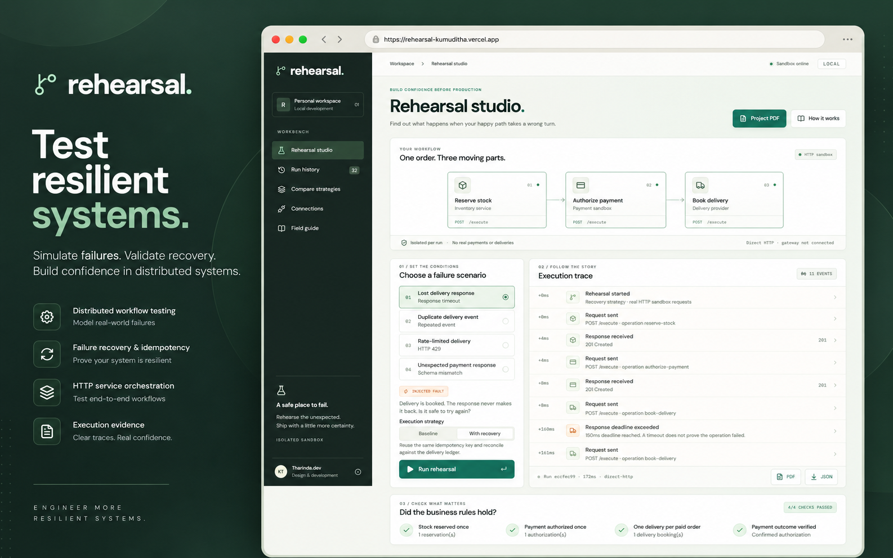
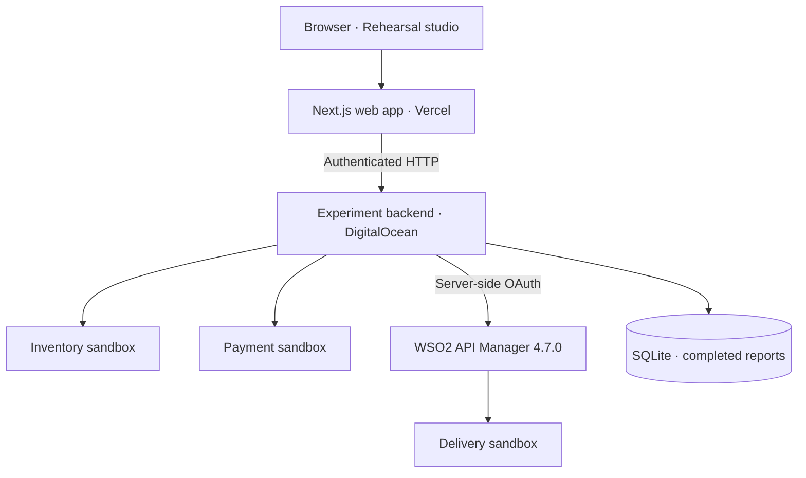

<div align="center">

# Rehearsal

### A safe place to test failure. A clearer way to understand recovery.

Explore API failures, compare recovery strategies, and inspect the evidence.

[Live studio](https://rehearsal-kumuditha.vercel.app) · [Project guide · PDF](https://rehearsal-kumuditha.vercel.app/docs/rehearsal-project-guide.pdf) · [Architecture](docs/ARCHITECTURE.md) · [WSO2 integration](docs/WSO2.md)

[](LICENSE)


</div>



<p align="center"><sub>Project artwork featuring the local studio. The hosted version routes delivery through WSO2 API Manager.</sub></p>

## Why Rehearsal exists

A small engineering lab for the question that comes after a timeout: **did the operation fail, or did we just lose the reply?**

Rehearsal sends an order through inventory, payment and delivery sandbox APIs. You introduce one failure, watch the requests unfold, and check the provider ledgers. Then you run the same scenario with a recovery strategy and compare the outcome.

It is a working engineering prototype, not a production chaos platform. No real payments, deliveries or customer data are involved. The default setup runs locally; the hosted architecture pairs a Vercel web app with a real HTTP backend on a VPS.

[Open the live studio](https://rehearsal-kumuditha.vercel.app). The public version runs the same HTTP experiments on a DigitalOcean VPS and saves reports in a browser-specific workspace. It is ready to try without installing anything.

[Download the illustrated project guide](https://rehearsal-kumuditha.vercel.app/docs/rehearsal-project-guide.pdf): 14 pages of plain-English explanations, actual screenshots, architecture and data-flow diagrams, observed results and deployment notes. Design and development: **Tharinda.dev**.

## Try the first experiment

Use Node.js 24. If you use nvm, run `nvm use` in this folder first.

```sh
npm ci
npm run dev
```

Open [localhost:3040](http://localhost:3040). The command starts the web app and all three providers. Keep that terminal open; Ctrl+C stops the processes it started.

On this Mac, you can also double-click `Start Rehearsal.command`. It selects Node 24 through an existing nvm installation and starts the lab; it does not stop anything else if a port is occupied.

1. Leave **Lost delivery response** and **Baseline** selected. Click **Run rehearsal**.
2. The provider books a delivery before delaying its response. The client times out and retries with a new key. Look at the failed delivery check: there are two bookings.
3. Click **Run with recovery**. This run reuses the same key. There should now be exactly one delivery.
4. Open **Compare strategies**, or download a PDF or JSON report from the trace footer. The numbers come from the provider ledgers, not a scripted animation.

Each attempt has its own run ID and starts with an empty ledger. The second run does not repair the first run's data; it tests a different decision against the same fault.

## The four scenarios

| Scenario           | What goes wrong                                                    | What recovery changes                                          |
| ------------------ | ------------------------------------------------------------------ | -------------------------------------------------------------- |
| Lost delivery response  | Delivery commits, then responds after the client's 150 ms deadline | Retry with the original operation key                          |
| Duplicate delivery event   | The same logical event triggers delivery twice                     | Map both attempts to the same operation key                    |
| Rate-limited delivery | The first delivery request receives HTTP 429                       | Wait for the sandbox's one-second Retry-After, then retry once |
| Unexpected payment response   | Payment commits but returns an unexpected response shape           | Confirm the authorization in the ledger before continuing      |

The duplicate-event scenario replays a trigger inside the runner. It is not a webhook receiver or a message broker.

## Built to make the evidence readable

- A responsive studio, live event trace and keyboard-accessible event details.
- Baseline/recovery comparison, committed-operation charts and saved run history.
- Downloadable PDF run reports with a summary, ledger chart, event timeline and complete trace; original JSON remains available separately and as a PDF attachment.
- Three HTTP providers with per-run isolation and idempotency handling.
- A TypeScript runner that evaluates four business rules.
- Event-by-event trace playback, active workflow nodes and directional flow animation. Reduced-motion preferences disable the animation and presentation delay; recorded server timings are never changed.
- SQLite storage for completed reports, under `.rehearsal/runs.sqlite`.
- A credential-protected hosted backend with workspace-scoped history, a lightweight systemd deployment and an optional Docker setup.
- Integration and architecture notes written for someone reading the project for the first time.

The hosted deployment routes delivery through **WSO2 API Manager 4.7.0**, using server-side OAuth client credentials. Inventory and payment remain direct HTTP; a default local checkout still needs no gateway. Separate live checks verify token rejection and gateway throttling without confusing them with the sandbox's injected failures. See [the WSO2 integration and evidence](docs/WSO2.md). Ballerina is not connected.

## How the hosted system fits together



**Stack:** Next.js · React · TypeScript · Node.js 24+ · SQLite · WSO2 API Manager · Playwright · pdf-lib · Vercel · DigitalOcean

The local setup runs all three providers directly and needs no gateway. OAuth credentials for the hosted delivery route stay on the server.

## Development

```sh
npm test              # Real HTTP integration tests; dedicated ports 14311–14313
npm run typecheck     # TypeScript checks
npm run test:e2e      # Browser checks; Chrome required, or set PLAYWRIGHT_CHANNEL
npm run build        # Production web build
```

The browser tests reuse a running dev server or start one. They create real local run reports, so test runs may appear in history. For a production-mode local check, run `npm run sandbox` in one terminal and `npm start` in another after building. The app is intentionally local-only; this is not a public deployment recipe.

Browser tests default to an installed Google Chrome (`chrome`). If you do not have Chrome, run `npx playwright install chromium`, then `PLAYWRIGHT_CHANNEL=chromium npm run test:e2e`. Fonts are served locally; their licenses are in `public/fonts`.

To run the same browser checks against a deployed app, set `PLAYWRIGHT_BASE_URL` to its HTTPS origin. For example: `PLAYWRIGHT_BASE_URL=https://rehearsal-kumuditha.vercel.app npm run test:e2e`. These checks create real sandbox reports in isolated visitor workspaces.

Default ports: web `3040`, inventory `4311`, payment `4312`, delivery `4313`. All listeners should stay on loopback. If a port is occupied, identify its owner rather than killing an unrelated process. `.env.example` shows the optional service URL overrides. Restart the app after changing `.env.local`.

## Project map

```text
Rehearsal/
├── src/                 Web studio, API routes, and shared application logic
├── sandbox/             Controlled HTTP providers
├── vps-backend/         Hosted experiment backend
├── integrations/        Integration configuration and supporting work
├── tests/               Automated checks and browser scenarios
├── scripts/             Development, verification, and PDF tooling
├── docs/                Architecture, deployment, and engineering evidence
├── public/              Published guide, fonts, and web assets
└── Assets/              Project artwork
```

## Read the design decisions

- [Architecture and limits](docs/ARCHITECTURE.md): where failures happen and what the checks actually prove.
- [WSO2 integration](docs/WSO2.md): configuration and verification boundaries.
- [Contribution evidence](docs/CONTRIBUTIONS.md): what could support an internship application, and what is still missing.
- [Demo walkthrough](docs/DEMO.md): a short explanation you can practice in your own words.
- [Verification record](docs/VERIFICATION.md): checks performed, issues found and remaining gaps.
- [Vercel and DigitalOcean deployment](docs/DEPLOYMENT.md): hosted backend, private credentials, persistent storage and live acceptance checks.
- [PDF exports and guide maintenance](docs/PDF-EXPORTS.md): download behavior, privacy, source assets and document regeneration.

## Known limits

Provider ledgers live in memory and disappear when the sandbox restarts. Completed reports survive in SQLite, but history shows only the latest 100 reports per workspace. The hosted backend authenticates the web proxy; visitors have opaque cookie-based workspaces, not user accounts. There is no team access, arbitrary API import, compensation workflow or distributed transaction coordinator. Unexpected provider outages produce an error rather than a saved completed report. Timings are observations from the execution host, not production benchmarks.

The recovery strategies are intentionally small and specific. Passing these tests does not prove an arbitrary system has exactly-once delivery. The useful artifact is a reproducible experiment and an explanation of the assumptions behind it.

## Contributing

Have a reproducible failure case, a clearer explanation, or a usability improvement? [Open an issue](https://github.com/mr-kumuditha/rehearsal/issues) with the scenario, expected behavior, and observed result. For code changes, keep the scope focused and run the relevant development checks above. Remove credentials and private workspace identifiers from shared logs and reports.

## License and credits

Rehearsal's original code and documentation are available under the [MIT License](LICENSE), copyright © 2026 Kumuditha Tharinda Liyanage.

Third-party dependencies and bundled fonts retain their own licenses. Font notices are included in [public/fonts](public/fonts). WSO2 and other product names belong to their respective owners; this is an independent project.

<div align="center">

**Designed and developed by Tharinda.dev**

[GitHub](https://github.com/mr-kumuditha) · [Try Rehearsal](https://rehearsal-kumuditha.vercel.app)

</div>
